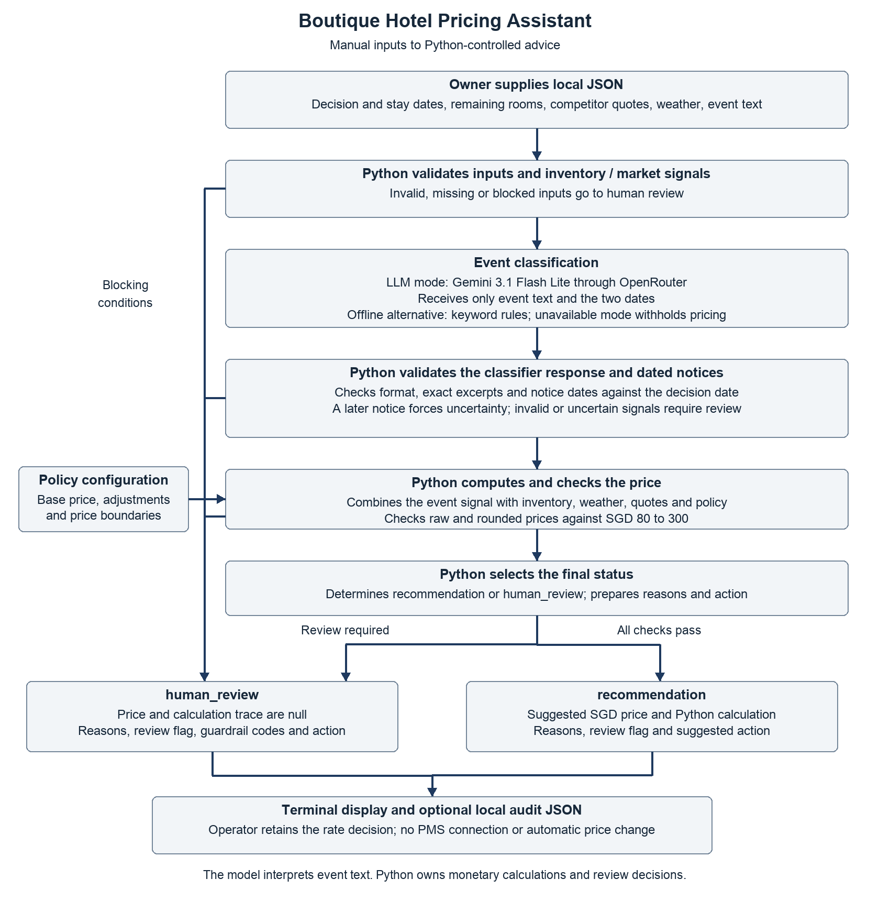

# Boutique Hotel Pricing Assistant product documentation

PE6201 Emerging AI Technologies · Feng Hao · Current implementation 0.5.0

## Persona and intended value

Mr Lin is a fictional owner who manages a 40-room Singapore boutique hotel
and reviews rates for one standard room type. He needs a consistent way to
weigh multiple signals before deciding on a rate. The prototype supports this
by showing how the inputs affect each suggestion and which issues require
checking. The operator supplies data and retains the decision to change a rate.

The product goal is a repeatable pricing review process, with traceable rule
execution and a request for human review when the system detects a blocking
issue. It combines room availability, competitor prices, weather and local
event information. It does not automate data collection or rate changes.
The persona describes an intended user, not an interviewed customer.

## Inputs

The operator supplies one local JSON object. Policy and model settings are
versioned separately in config/. All evaluation inputs are synthetic.

| Input field | Meaning and validation |
|---|---|
| as_of_date | Explicit decision date in YYYY-MM-DD format |
| target_date | Stay date, from 0 to 90 days after the decision date |
| remaining_rooms | Integer from 0 to 40; sold-out inventory blocks pricing |
| competitor_prices_sgd | At least three valid comparable SGD quotes for the same stay date, standard room type and tax basis |
| weather | clear, cloudy, rain, severe or unknown; severe or unknown requires review |
| event_description | Nonempty untrusted activity text, at most 4,000 characters |
| source_type and source_note | Optional provenance information; they do not establish source authenticity |

Python can validate the numbers, but the operator must check that the quotes
are comparable and that competitors actually posted them.

## Outputs

| Output field | Meaning |
|---|---|
| status | recommendation or human_review |
| suggested_price_sgd | Python-calculated SGD price for a recommendation; null for review |
| reasons and suggested_action | Explanation of the decision and the recommended next action |
| must_human_review | Whether the advice must be withheld for human checking |
| guardrail_codes | The validation or policy conditions that triggered review |
| event_classification | Validated event impact and reason if classification was obtained |
| calculation | Python calculation trace for a recommendation; null for review |
| audit | Versions, timestamps, classifier provenance and actual request metadata where available |

The terminal displays the result, and an optional output path saves a local
audit JSON file. Neither output writes to a property management system or
changes a hotel's selling price.

## High level product architecture

*Figure 1 Product architecture and decision flow*

Python receives the full input. Only event text and the two dates are sent to
Google Gemini 3.1 Flash Lite through OpenRouter. The model returns high, medium,
low or uncertain impact, a reason, and dated status notices with exact excerpts.
Python validates the response and excerpts, then compares notice dates with
the decision date. A later notice forces uncertainty and review. Omitted
notices and semantic errors remain possible.

For offline evaluation, the keyword classifier uses the same service and
pricing policy without a model request. An unavailable classifier also
withholds pricing. Validation or guardrail failure at a Python stage leads
to human_review with no price or calculation trace.

Python combines the validated event signal with room availability, weather,
competitor quotes and the policy. It averages the SGD 150 base price and median
quote, then applies additive inventory, weekend and event adjustments. Both
raw and rounded prices must remain within SGD 80 to 300. The model does not
calculate a price or decide the final review status, although an incorrect
event label can indirectly affect the price adjustment.

## Build and rent decisions

The project owns the local interface, orchestration, pricing rules, validation,
evaluation and audit records. Python provides direct control over decimal
arithmetic and rejection paths, with maintenance work retained by the author.
Only event interpretation is rented through OpenRouter. Network or response
failures withhold prices. There is no property management integration,
automatic repricing, browser automation, agent, document retrieval or trained
prediction model. Credible hotel operating history was not available for
training a predictor. See [policy](POLICY.md) and [model setup](OPENROUTER_SETUP.md).

## Metrics targeted and metrics reached

The targets below are the original evaluation targets. Reached values come
from the actual refined model run, not from unit-test fixtures. Required human
review is the positive class. Regular and challenge results are reported
separately; the challenge group is named hard in saved files.

| Metric | Target | Actual refined result | Assessment |
|---|---|---|---|
| Challenge review recall | 100% | 15/16 = 93.75% | Not met |
| Challenge review precision | At least 80% | 15/15 = 100% | Met |
| Regular safe-price coverage | At least 90% | 180/180 = 100% | Met |
| Regular price success | At least 90% | 180/180 = 100% | Met; policy consistency |
| Challenge price success | At least 75% | 4/4 = 100% | Met; limited sample |
| Unsafe price releases | Zero | Regular 0; challenge 1 | Not met |
| Output invariant violations | Zero | Regular 0; challenge 0 | Met; does not prove semantic correctness |

The following measurements support interpretation rather than add new success
thresholds after the evaluation.

| Additional measurement | Regular group | Challenge group |
|---|---|---|
| Case count | 200 | 20 |
| Review TP / FP / FN / TN | 20 / 0 / 0 / 180 | 15 / 0 / 1 / 4 |
| Event accuracy | 200/200 = 100% | 9/10 = 90% |
| Expected guardrail codes matched | 20/20 | 19/20 |

Source [report.json](../results/refinement_01/openrouter_run_01/report.json)
and [readable results](../results/refinement_01/openrouter_run_01/REPORT.md).
Per-case comparisons and guardrail evidence are in case_results.jsonl in the
same directory. Target assessment and the before/after comparison are in
[SUMMARY.md](../results/refinement_01/SUMMARY.md).

### Baseline and refinement comparison

| System and group | TP | FP | FN | TN | Price hits / eligible |
|---|---|---|---|---|---|
| Inventory baseline challenge | 10 | 0 | 6 | 4 | 0/4 |
| Keyword baseline challenge | 16 | 3 | 0 | 1 | 0/4 |
| Initial model challenge | 14 | 0 | 2 | 4 | 4/4 |
| Refined model challenge | 15 | 0 | 1 | 4 | 4/4 |
| Refined model regular | 20 | 0 | 0 | 180 | 180/180 |

The challenge labels require review for 16 cases and permit pricing for four,
reflecting the focus on risk detection and limiting the price assessment
sample. Only ten challenges reach event classification, and none has a medium
impact reference. Regular cases measure policy reproduction because their
reference prices share the rulebook.

Keywords missed no required challenge reviews but unnecessarily reviewed
three safe cases and achieved no challenge price hits. Keywords also matched
all regular prices. The model provided more usable challenge prices, but
missed one required warning. These results do not establish unconditional
model superiority.

### Actual cost and engineering checks

The refined evaluation made 210 real requests and cost USD 0.06170, compared
with USD 0.04234 initially. Additional extraction increased total API cost by
approximately USD 0.0194 and corrected one observed failure. At this scale,
the cost difference is small. Further testing should establish whether the
improvement remains reliable on new cases. Average cost was USD 0.000294 per
request and median request duration was 1.064 seconds. These measurements
exclude development labour and manual data collection.

The implementation passed 115 offline tests and 677 checks of saved evaluation
evidence. These verify engineering behavior and recorded results; they do not
replace the model performance measurements. See [testing](TESTING.md).

## Failure analysis and evidence limits

H014 demonstrates the date safeguard. The model still proposed low impact,
but Python detected a status notice later than the decision date and withheld
the price. H016 demonstrates price ceiling enforcement, while H020 shows
review of hostile instructions.

H013 remains a scored missed review. Low lodging impact is plausible for a
wholly virtual event, while the fixed reference requires review of conflicting
attendance claims. The reference was retained, and this interpretation needs
hotel expert review. See [failure analysis](../results/refinement_01/FAILURE_ANALYSIS.md).

The 20 challenges were supplied from three other models, with two disclosed
edits before evaluation. Cases and reference labels were approved and frozen
before running. Original authoring model names and prompts are unavailable.
AI assistance in coding and curation is disclosed in the
[data explanation](../data/README.md). Reusing cases inspected after the first
run makes the refined evaluation a regression check, not an independent test.

Correct arithmetic and valid response formatting cannot ensure correct event
interpretation. Exact excerpts establish presence in the input, not the truth
of the claim. Further evaluation should validate the pricing policy and use
new independent cases. An owner pilot should measure review time, missed
warnings and revenue effects against current practice. These business outcomes
have not yet been measured.
